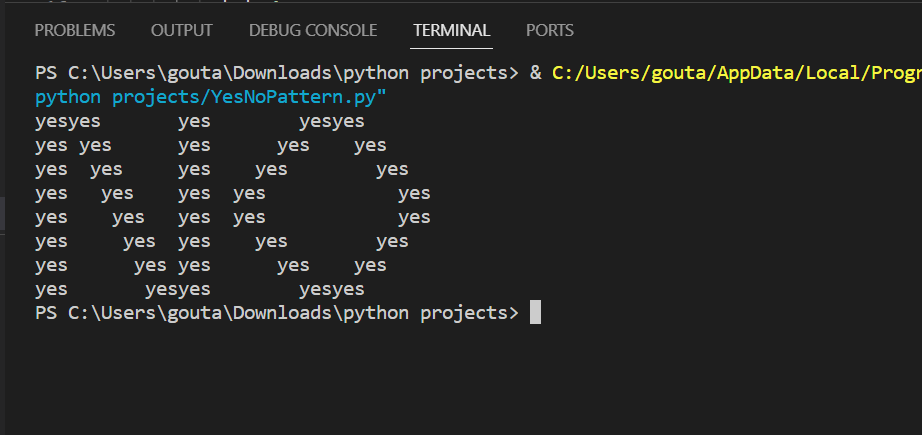

# No_Yes Pattern Generator

## Overview

The `no_yes` program generates a pattern using the words "yes" and spaces, creating a visually interesting output. The pattern is created based on a set of rules that determine the spacing and arrangement of the "yes" elements.

## How to Use

1. Clone the repository:

   ```bash
   git clone https://github.com/GunjanPasricha/YesNoPATTERN.git
   ```

2. Navigate to the project directory:

   ```bash
   cd no_yes-pattern-generator
   ```

3. Run the program:

   ```bash
   python no_yes_generator.py
   ```

## Output

The program will display a pattern with "yes" and spaces, following a specific arrangement determined by the provided rules.


## Contributing

If you'd like to contribute to the development of this pattern generator, please follow these guidelines:

1. Fork the repository.
2. Create a new branch.
3. Make your changes.
4. Submit a pull request.


Enjoy creating unique patterns with the `no_yes` generator!

